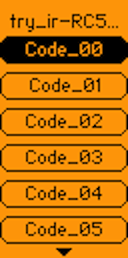

# Flipper File Toolbox #
---


Random scripts and links for generating [Flipper Zero](https://flipperzero.one/) data files.

(An occasional work in Progress)

These scripts are mostly "works for me" level testing, pull requests welcome

=======

Recent Addition:

&nbsp;&nbsp;&nbsp;**subghz_ook_to_sub.py**
:  convert .ook files produced by [rtl_433](https://github.com/merbanan/rtl_433) to the Flipper .sub format

&nbsp;&nbsp;&nbsp;**subghz_x10.py** 
:  Generates x10 rf commands in Flipper subghz file format

&nbsp;&nbsp;&nbsp;**subghz_insteon.py** 
:  Generates insteon home automation rf commands in Flipper subghz file format

---

## Tools ##

---

#### [subghz_ook_to_sub.py](subghz_ook_to_sub.py) ####


Convert signals captured/recorded [rtl_433](https://github.com/merbanan/rtl_433) (or [rtl-sdr](https://osmocom.org/projects/rtl-sdr/wiki/Rtl-sdr) ) to the FlipperZero .sub format.

<details><summary>More Info:</summary>

Example:


convert rtl-sdr raw data file (keyfob_capture.cu8) into .ook file

> `rtl_443 -r g001_433.92M_250k.cu8 -w keyfob_capture.ook`

convert `.ook` file into FlipperZero `.sub` format.

> `subghz_ook_to_sub.py keyfob_capture.ook`

then copy keyfob_capture.sub to your Flipper

</details>

---

#### [nfc_prox2flip.py](nfc_prox2flip.py) ####

Python script to convert proxmark json dump into Flipper NFC Save File

>`nfc_prox2flip.py test_dat/mf-classic-1k-23AD7C86.json > mfc1k-23AD7C86.nfc`

---

#### [nfc_gen_phone.py](nfc_gen_phone.py) ####
Generates NFC with a telephone number and saves it to a Flipper NFC "save" file.

<details><summary>More Info:</summary>

You must provide the phone number with area code THEN the +country-code. The final file will be called `call-me.nfc` and will be saved to the same directory as the python program. Rename it manually if you'd like then copy it over to your Flipper.

Example:
> `nfc_gen_phone.py 8185551122 +1`

Note: requires [ndeflib](https://github.com/nfcpy/ndeflib) (available on [pypi](https://pypi.org/project/ndeflib/))

</details>

---

#### [nfc_gen_wifi.py](nfc_gen_wifi.py) ####

Generates NFC with WiFi Tag Data and saves it to a Flipper NFC "save" file.

<details><summary>More Info:</summary>

This program takes no arguments. You will be prompted for all the relevant wireless network info (see below). The final file will be called `WiFi.nfc` and will be saved to the same directory as the python program. Rename it manually if you'd like then copy it over to your Flipper.

You need the following wireless network information:
- SSID 
- Authentication Type: WPA/WPA2-Personal or WPA/WPA2-Enterprise (might not work)
- Encryption Type: AES or TKIP
- Password
- Radio Band: 2.4GHz or 5.0GHz

> `./nfc_gen_wifi.py`

Tap your phone to the emulated tag on the Flipper Zero and your device will join the WiFi network you've encoded.

Note: requires [ndeflib](https://github.com/nfcpy/ndeflib) (available on [pypi](https://pypi.org/project/ndeflib/))

</details>

---

#### [nfc_gen_url.py](nfc_gen_url.py) ####

Generates NFC with URL address data and outputs Flipper NFC "save" file format

<details><summary>More Info:</summary>


>`nfc_gen_url.py https://youtu.be/dQw4w9WgXcQ "Rick Roll" > rick_roll.nfc`

see file [rick_roll.nfc](nfc/Rick_Roll.nfc)

Note: requires [ndeflib](https://github.com/nfcpy/ndeflib) (available on [pypi](https://pypi.org/project/ndeflib/))

</details>

---


#### [ir_plot.py](ir_plot.py) ####

Plot signal data from flipper IR raw data save files

<details><summary>More Info:</summary>

Usage: 

```
ir_plot.py [-h] [-v] [-n CMD_NAME] [-f FILENAME] 
           [-i] [-d DESTDIR] [-o {png,pdf,svg}] [-s]
```

>`ir_plot.py IR/Lego_Train.ir Reverse`

Will split signal into retransmition samples and plot separately (see code for other options)

</details>

---

#### [ir_gen_all_codes.py](ir_gen_all_codes.py) ####



Generates file Flipper IR file with all possible command codes for a given address

(great for finding hiddem menus)

<details><summary>More Info:</summary>

>`ir_gen_all_codes.py.py RC5 03 00`

Will generate file with all possible command codes for IR remote protocol: [RC5 protocaal](https://en.wikipedia.org/wiki/RC-5) , address 03 00 00 00 in filename [IR-CMD-RC5-03.ir](IR/IR-CMD-RC5-03.ir)

</details>

---

#### [subghz_x10.py](subghz_x10.py) ####

Generates x10 rf command in Flipper subghz file format

<details><summary>More Info:</summary>

Valid options:

	subghz_x10.py <housecode>[unit] <command>

Valid Commands:

       ON OFF BRT DIM ALL-OFF ALL-ON ALL-LTS-OFF ALL-LTS-ON

Example:

>`./subghz_x10.py C5 On` 

Will generate filename C05_on.sub 

Brute Force :

>`./subghz_x10.py -b`

Generates [All-ON](subghz/X10_All-OFF.sub) and [ALL-OFF](subghz/X10_All-OFF.sub) files conraining all housecodes	
	
NOTE: In North America, the X-10 RF carrier frequency is 310MHz. Outside North America it is 433.92MHz.
	
</details>

---
#### [subghz_insteon.py](subghz_insteon.py) ####

Generates insteon rf command in Flipper subghz file format

>`./subghz_insteon.py 247846 4C1B16 On > hall-light_on.sub`

<details><summary>More Info:</summary>

Syntax

       subghz_insteon.py SRC DST On 

Valid Commands:

       ON FASTON OFF FASTOFF BRIGHTEN BRT DIM FADEDOWN FADEUP STOP FADESTOP BEEP
       
Note:

An Insteon device needs to be "paired" before it will accept command from andother device,  but there is no authenticaion.

The easiest way to get the insteon node id/address of a pair is to run rtl_433

Example command:
>rtl_433 -f 914.8M -s 2048k -R 159 -Y classic

Example output:

```
time      : 2022-11-28 21:36:45
model     : Insteon      From_Addr : 4C1B63        To_Addr   : 347864        Message_Type: 0
Message_Str: Direct Message                        Extended  : 0             Hops_Max  : 3
Hops_Left : 0            Packet    : 03 : 247864 : 4C1B61 : 13 00  BE        Integrity : CRC
Payload   : 03647824611B4C1300BE00
```

</details>

---

#### [subghz_histogram.py](subghz_histogram.py) ####


Script to read Flipper SubGhz RAW File and plot 0 & 1 segment lengths using pyplot

Based on @[jinschoi](https://gist.github.com/jinschoi)'s [histogram_sub.py](https://gist.github.com/jinschoi/8396f25a4cb7ac7986a7d881026ae950)
and modified to plot 0 & 1 segments separately.

>`subghz_histogram.py sample.sub`

---

#### [subghz_create_dat.py](subghz_create_dat.py) ####

Based on @[jinschoi](https://gist.github.com/jinschoi)'s [create_sub.py](https://gist.github.com/jinschoi/f39dbd82e4e3d99d32ab6a9b8dfc2f55)

Python script to generate Flipper RAW .sub files from 01 bitstreams

Added :
* FSK support
* insteon (funtional)
* FAN-11T Remote Control of Harbor Breeze Fan (Brute Force)

---

#### [subghz_gen_cmd.py](subghz_gen_cmd.py) ####

A command line based Python script to generate Flipper RAW .sub files

<details><summary>More Info:</summary>

Usage: 

```
subghz_gen_cmd.py [-h] [-v] [-o OUT_FILE] [-f SEND_FREQ] [-0 ZERO_LEN] [-1 ONE_LEN] [-i] 
                  [-b BAUD_RATE] (-H HEX_DATA | -B BIN_DATA) [-p MOD_PRESET] [-m] 
		  [-r REPEAT_CNT] [-d DELAY_PADDING]
```

Example:

>`subghz_gen_cmd.py -f 302500000 -0 333 -1 333 -m -B 0110100001000`

</details>

---

#### [subghz_preset_gen.py](subghz_preset_gen.py) ####

Generates CC1101 "SubGhzPresetCustom" settings

<details><summary>Info:</summary>

Usage:

```
subghz_preset_gen.py [-h] [-p {AM270,AM650,FM238,FM476}] [-pr] [-sw SYNC_WORD] [-sm SYNC_MODE]
			[-mod {2FSK,4FSK,GFSK,MSK,OOK}] [-lc {Fixed,Infinite,Variable}]
		        [-pl PKT_LEN] [-v] [-n CONF_NAME] [-if INTERMEDIATE_FREQ] [-dr DATA_RATE]
			[-fr FREQUENCY] [-bw BAND_WIDTH] [-np NUM_PREAMBLE] [-dev DEVIATION]
			[-cs CHANNEL_SPACING] [-man] [-crc {on,off}] [-dw {on,off}]
```


The following loads Preset 2FSKDev238Async sets FM deviation to 6000 Hz and turns on manchester encoding

> `subghz_preset_gen.py  -p  FM238  --deviation 6000 -pr --manchester`

Generates:

```
Custom_preset_name: NewPreset
Custom_preset_module: CC1101
Custom_preset_data: 02 0D 07 04 08 32 0B 06 10 67 11 83 12 0C 13 02 14 00 15 17 18 18 19 16 1B 07 1C 00 1D 91 20 FB 21 56 22 10 00 00 C0 00 00 00 00 00 00 00
```

</details>


---

#### [subghz_decode_presets.py](subghz_decode_presets.py) ####

Decodes CC1101 "SubGhzPresetCustom" settings from Flipper saved sample file or settings_user (subghz/assets/setting_user) file.

> `subghz_decode_presets.py test_dat/Raw_Sample.sub`

for more info see the CC1101 Datasheet [cc1101.pdf](https://www.ti.com/lit/ds/symlink/cc1101.pdf)

<details><summary>More Info:</summary>
Reads:

```
Filetype: Flipper SubGhz RAW File
Version: 1
Frequency: 433920000
Preset: FuriHalSubGhzPresetCustom
Custom_preset_module: CC1101
Custom_preset_data: 02 0D 03 07 08 32 0B 06 14 00 13 00 12 30 11 32 10 17 18 18 19 18 1D 91 1C 00 1B 07 20 FB 22 11 21 B6 00 00 00 C0 00 00 00 00 00 00
```

Generates:

```
FuriHalSubGhzPresetCustom

as_tuples:
[   ('IOCFG0', 13), ('FIFOTHR', 7), ('PKTCTRL0', 50), ('FSCTRL1', 6),
    ('MDMCFG4', 23), ('MDMCFG3', 50), ('MDMCFG2', 48), ('MDMCFG1', 0),
    ('MDMCFG0', 0), ('MCSM0', 24), ('FOCCFG', 24), ('AGCCTRL2', 7),
    ('AGCCTRL1', 0), ('AGCCTRL0', 145), ('WORCTRL', 251), ('FREND1', 182),
    ('FREND0', 17), ('PATABLE', [0, 192, 0, 0, 0, 0, 0, 0])]

rf_conf
    Intermediate_freq:        152343.75 Hz
    Modulations:              OOK
    Data_Rate:                3793.72 Hz
    Bit_Width:                263.59 ms
    Channel_Bandwidth:        650000.00 Hz
    Sync_Mode:                SYNCM_NONE
    Channel_spacing:          25390.62 Hz
    Manchester:               0
    Variable_length_packet:   Infinite packet length
    Enable_Pkt_CRC:           0
    Pkt_DataWhitening         0
    Min_TX_Preamble:          0
    PA_Table:                 [0, 192, 0, 0, 0, 0, 0, 0]

```

Eventually this will be able to read a config file and generate "Custom_preset" radio settings.

*WARNING : this is shit code and still needs a lot of work and cleanup. (I'm surprised it works)*

</details>

---

#### [nfc_hexdump.py](nfc_hexdump.py) ####

reads Flipper NFC dump and adds ascii and hex to RFID HEX dump (for easier file analysis)

>`nfc_hexdump.py nfc/Rick_Roll.nfc`

<details><summary>More Info:</summary>

In:
```
    Page 4: 03 29 91 01
    Page 5: 15 55 04 79
    Page 6: 6F 75 74 75
    Page 7: 2E 62 65 2F
```

Out:
```
    Page 4: 03 29 91 01 #   - ) - -         3  41 145   1
    Page 5: 15 55 04 79 #   - U - y        21  85   4 121
    Page 6: 6F 75 74 75 #   o u t u       111 117 116 117
    Page 7: 2E 62 65 2F #   . b e /        46  98 101  47
```

</details>

---

## Files ##

---

### [NFC](nfc) ###

Random Collection of flipper [NFC signals files](nfc)

---

### [IR](IR) ###

Random Collection of flipper [IR signal files](IR)

---

### [Subghz](subghz) ###

A Collection of Generated [Subghz Signal Files](subghz)

---

## See Also: ##

* [Flipper Zero Official Forum](https://forum.flipperzero.one/) :
	Community of Flipper Zero Users & Developers.

* [flipperzero_cmd](https://github.com/evilpete/flipperzero_protobuf_py) :
        A command line based tool for file transfer and remote command <br> *(Work in Progress)*

* [Brute-Force CAME 12bit Gate Codes](https://github.com/BitcoinRaven/CAMEbruteforcer)
        Generate sub files which have all the possible keys combination for CAME gate

* [FlipperScripts](https://github.com/DroomOne/FlipperScripts.git) :
	Reads the `DolphinStoreData` struct from `dolphin.state` files.

* [create_sub.py](https://gist.github.com/jinschoi/f39dbd82e4e3d99d32ab6a9b8dfc2f55) :
	Python script to generate Flipper RAW .sub files from OOK bitstreams.

* [bitstream-from-sub.py](https://gist.github.com/jinschoi/40a470e432c6ac244be8159145454b5c) :
	Decode raw bitstring captured Flipper RAW .sub file.

* [csv2ir](https://github.com/Spexivus/csv2ir) :
	csv2ir is a script to convert ir .csv files to .ir files for the flipper.

* [flipperzero-goodies](https://github.com/wetox-team/flipperzero-goodies) :
	More scripts resources

* [awesome-flipperzero](https://github.com/djsime1/awesome-flipperzero) :
	Another collection of links for the Flipper Zero device.

* [flipperzero-firmware](https://github.com/Eng1n33r/flipperzero-firmware.git) :
	Flipper Zero's Custom Firmware with max features.

* [Flipper Zero Hacking 101](https://flipper.pingywon.com/) :
	*yet another* collection of links.

* [T119 bruteforcer](https://github.com/xb8/t119bruteforcer) :
	 Triggers Retekess T119 restaurant pagers

* [Flipper Zero Hacking 101](https://github.com/tobiabocchi/flipperzero-bruteforce) :
	A collection of Brute force subghz fixed code protocols


